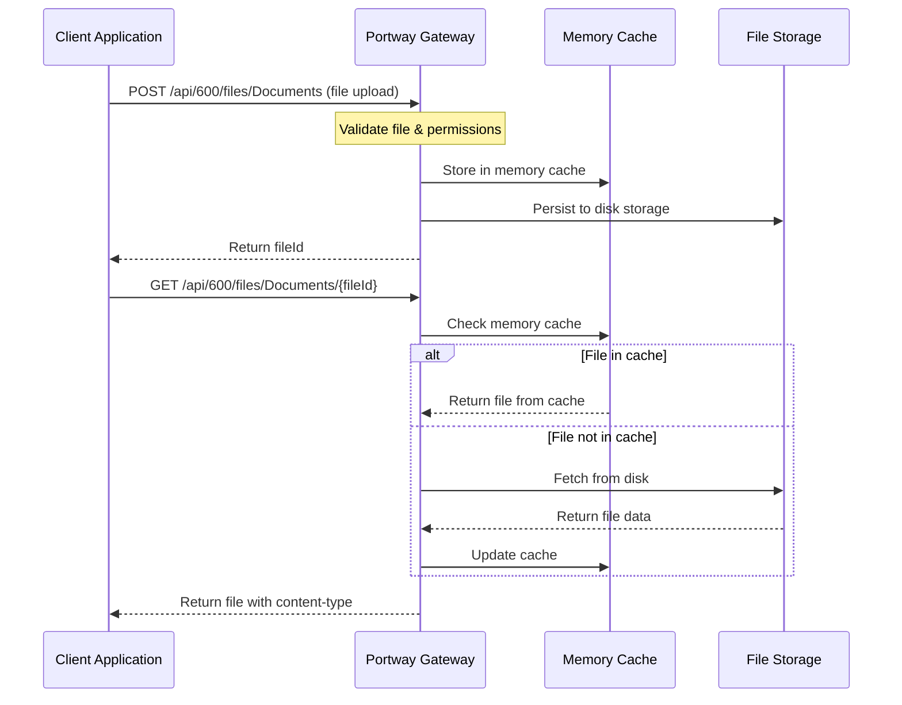

# File Endpoints

File endpoints in Portway provide a simple yet powerful way to store, retrieve, and manage files in your application. These endpoints handle file operations through a RESTful API interface, making it easy to build file storage capabilities into your services without complex infrastructure.

## Overview

File endpoints allow you to:
- Upload files to secure storage
- Download files through API endpoints
- Delete files when no longer needed
- List available files with metadata
- Restrict file types for security
- Organize files by environment and category

## How File Endpoints Work



## Configuration

### Basic File Endpoint Configuration

Create a JSON file in the `endpoints/Files/Documents/entity.json` directory:

```json
{
  "StorageType": "Local",
  "BaseDirectory": "documents",
  "AllowedExtensions": [".pdf", ".docx", ".xlsx", ".txt"],
  "IsPrivate": false,
  "AllowedEnvironments": ["600", "700"]
}
```

### Configuration Properties

| Property | Type | Required | Description |
|----------|------|----------|-------------|
| `StorageType` | string | Yes | Storage provider type (currently "Local") |
| `BaseDirectory` | string | No | Base directory for storing files (relative to storage root) |
| `AllowedExtensions` | array | No | List of allowed file extensions (empty = allow all) |
| `IsPrivate` | boolean | No | Whether the endpoint is hidden from public documentation |
| `AllowedEnvironments` | array | No | List of environments that can access this endpoint |

## Storage System

### Local Storage

Files are stored in the configured file system:

```
{StorageDirectory}/{Environment}/{BaseDirectory}/{Filename}
```

Example:
```
files/600/documents/report-2024.pdf
```

### Memory Caching

For performance optimization, files can be cached in memory:

- **Cache Duration**: Configurable, default 60 seconds
- **Cache Limit**: Maximum total size in memory (default 200MB)
- **Cache Eviction**: Least recently used (LRU) policy
- **Cache Persistence**: Files are flushed to disk periodically

## Using File Endpoints

### File Endpoint URL Format

```
/api/{environment}/files/{endpointName}
```

- `{environment}`: Target environment (e.g., "600", "700")
- `{endpointName}`: Name of the file endpoint (e.g., "Documents", "Images")

### File Operations

#### 1. Upload Files

```http
POST /api/600/files/Documents
Content-Type: multipart/form-data
Authorization: Bearer <token>

Form Data:
  - file: [binary file data]
  - overwrite: true (optional)
```

Response:
```json
{
  "success": true,
  "fileId": "NjAwOmRvY3VtZW50cy9yZXBvcnQucGRm",
  "filename": "report.pdf",
  "contentType": "application/pdf",
  "size": 125679,
  "url": "/api/600/files/Documents/NjAwOmRvY3VtZW50cy9yZXBvcnQucGRm"
}
```

#### 2. Download Files

```http
GET /api/600/files/Documents/NjAwOmRvY3VtZW50cy9yZXBvcnQucGRm
Authorization: Bearer <token>
```

Response: Binary file with appropriate content-type header

#### 3. Delete Files

```http
DELETE /api/600/files/Documents/NjAwOmRvY3VtZW50cy9yZXBvcnQucGRm
Authorization: Bearer <token>
```

Response:
```json
{
  "success": true,
  "message": "File deleted successfully"
}
```

#### 4. List Files

```http
GET /api/600/files/Documents/list?prefix=reports/
Authorization: Bearer <token>
```

Response:
```json
{
  "success": true,
  "files": [
    {
      "fileId": "NjAwOmRvY3VtZW50cy9yZXBvcnRzL3ExLnBkZg==",
      "fileName": "reports/q1.pdf",
      "contentType": "application/pdf",
      "size": 245830,
      "lastModified": "2024-03-10T14:30:45Z",
      "url": "/api/600/files/Documents/NjAwOmRvY3VtZW50cy9yZXBvcnRzL3ExLnBkZg=="
    },
    {
      "fileId": "NjAwOmRvY3VtZW50cy9yZXBvcnRzL3EyLnBkZg==",
      "fileName": "reports/q2.pdf",
      "contentType": "application/pdf",
      "size": 289436,
      "lastModified": "2024-05-15T09:45:22Z",
      "url": "/api/600/files/Documents/NjAwOmRvY3VtZW50cy9yZXBvcnRzL3EyLnBkZg=="
    }
  ],
  "count": 2
}
```

## File Endpoint Types

### Document Repository

Configure storage for business documents:

```json
{
  "StorageType": "Local",
  "BaseDirectory": "documents",
  "AllowedExtensions": [".pdf", ".docx", ".xlsx", ".txt", ".csv"],
  "IsPrivate": false,
  "AllowedEnvironments": ["600", "700"]
}
```

### Image Gallery

Configure storage for image files:

```json
{
  "StorageType": "Local",
  "BaseDirectory": "images",
  "AllowedExtensions": [".jpg", ".jpeg", ".png", ".gif", ".svg", ".webp"],
  "IsPrivate": false,
  "AllowedEnvironments": ["600", "700"]
}
```

### Secure Reports Repository

Configure storage for sensitive reports:

```json
{
  "StorageType": "Local",
  "BaseDirectory": "reports",
  "AllowedExtensions": [".pdf", ".xlsx"],
  "IsPrivate": true,
  "AllowedEnvironments": ["600"]
}
```

### Data Import/Export

Configure storage for data exchange:

```json
{
  "StorageType": "Local",
  "BaseDirectory": "data-exchange",
  "AllowedExtensions": [".csv", ".json", ".xml", ".xlsx"],
  "IsPrivate": false,
  "AllowedEnvironments": ["600", "700"]
}
```

### Temporary Files

Configure storage for ephemeral files:

```json
{
  "StorageType": "Local",
  "BaseDirectory": "temp",
  "AllowedExtensions": [],
  "IsPrivate": false,
  "AllowedEnvironments": ["600", "700", "Dev"]
}
```

## Security Considerations

### Authentication

All file endpoints require Bearer token authentication:

```http
Authorization: Bearer <your-token>
```

### Extension Restrictions

For security, you can restrict which file extensions are allowed:

```json
"AllowedExtensions": [".pdf", ".docx", ".xlsx"]
```

Files with other extensions will be rejected with a 400 Bad Request.

### Blocked Extensions

Certain high-risk extensions are globally blocked regardless of configuration:

```json
"BlockedExtensions": [".exe", ".dll", ".bat", ".sh", ".cmd", ".msi", ".vbs"]
```

### Size Limits

File uploads are limited by a configurable maximum size:

```json
"MaxFileSizeBytes": 52428800  // 50MB default
```

### Environment Isolation

Files are isolated by environment, preventing cross-environment access:

```
/api/600/files/Documents  // Only accesses files in 600 environment
/api/700/files/Documents  // Only accesses files in 700 environment
```

### Path Traversal Protection

The system prevents path traversal attacks by:
- Sanitizing filenames
- Removing directory components
- Replacing invalid characters
- Validating file IDs

## Best Practices

### 1. Use Specific Directories

Organize files logically with dedicated base directories:

```json
{
  "BaseDirectory": "invoices/2024"  // ✓ Good
}
```

Instead of:

```json
{
  "BaseDirectory": ""  // ✗ Not recommended
}
```

### 2. Restrict File Types

Always specify allowed extensions for security:

```json
{
  "AllowedExtensions": [".pdf", ".jpg", ".png"]  // ✓ Good
}
```

Instead of:

```json
{
  "AllowedExtensions": []  // ✗ Allows any extension
}
```

### 3. Environment-Specific Configuration

Limit environments that can access sensitive files:

```json
{
  "AllowedEnvironments": ["600"]  // ✓ Production only
}
```

### 4. Implement File Cleanup

Regularly clean up temporary files:

```sql
-- Create stored procedure for file cleanup
CREATE PROCEDURE CleanupTempFiles
AS
BEGIN
    -- Your cleanup logic
END
```

### 5. Use Prefixes for Organization

When listing files, use prefixes to navigate directory structures:

```http
GET /api/600/files/Documents/list?prefix=reports/2024/
```

## Troubleshooting

### Common Issues

1. **File upload failed: "File size exceeds maximum allowed size"**
   - Check file size is under the configured limit (default 50MB)
   - If larger files are needed, adjust `MaxFileSizeBytes` in configuration

2. **File upload failed: "Files with extension .exe are not allowed"**
   - Verify file extension is in the `AllowedExtensions` list
   - Certain extensions are blocked for security and cannot be allowed

3. **File not found**
   - Verify the file ID is correct
   - Check file hasn't been deleted
   - Ensure you're accessing from the correct environment

4. **"Environment not allowed" error**
   - Check that the environment is in the `AllowedEnvironments` list
   - Verify the environment exists in global settings

### Debugging File Operations

1. **Check file existence on disk**:
   ```
   files/600/documents/your-file.pdf
   ```

2. **Review application logs**:
   ```
   log/portwayapi-yyyyMMdd.log
   ```

3. **Test basic file operations**:
   ```bash
   # Upload test file
   curl -X POST https://your-api/api/600/files/Documents \
     -H "Authorization: Bearer <token>" \
     -F "file=@test.pdf"
     
   # List files
   curl -X GET https://your-api/api/600/files/Documents/list \
     -H "Authorization: Bearer <token>"
   ```

## File IDs Explained

File IDs are base64-encoded identifiers containing:
- Environment
- Relative file path

For example:
- `NjAwOmRvY3VtZW50cy9yZXBvcnQucGRm` decodes to `600:documents/report.pdf`

This design ensures:
- File IDs are URL-safe
- Environment isolation is maintained
- Path information is obscured

## File vs Other Endpoints

| Feature | File Endpoints | SQL Endpoints | Proxy Endpoints | Webhook Endpoints |
|---------|---------------|---------------|----------------|-------------------|
| Purpose | File storage & retrieval | Database operations | Service forwarding | Event receiving |
| HTTP Methods | GET, POST, DELETE | GET, POST, PUT, DELETE | Configurable | POST only |
| Response | Binary files or file metadata | JSON data | Service response | Success confirmation |
| Use Case | Document management | Data operations | Service integration | Event processing |

## Performance Optimizations

### 1. Memory Caching

Files are cached in memory for faster access:

- Recently accessed files remain in memory
- Most frequently accessed files stay cached longer
- Cache is automatically managed based on memory limits

### 2. Deferred Disk Writes

File uploads benefit from optimized disk I/O:

- Files are stored in memory first
- Batch flushing reduces disk operations
- Background thread handles persistence

### 3. Filesystem Indexing

File listings use an index for faster querying:

- Directory structure is cached in memory
- File metadata is pre-loaded
- Prefix filtering happens in memory

## Limitations

1. **Local Storage Only**: Currently only local filesystem storage is supported
2. **No Versioning**: File overwrites replace the previous version completely
3. **No Thumbnails**: Image thumbnails are not automatically generated
4. **No Content Scanning**: Files are not scanned for viruses or malware
5. **No CDN Integration**: No built-in content delivery network support

## Next Steps

- Configure [SQL Endpoints](/guide/endpoints/sql) for file metadata database storage
- Set up [Security](/guide/security) for file access control
- Implement [Monitoring](/guide/operations/monitoring) for file storage usage
- Create [Composite Endpoints](/guide/endpoints/composite) to process files with business logic